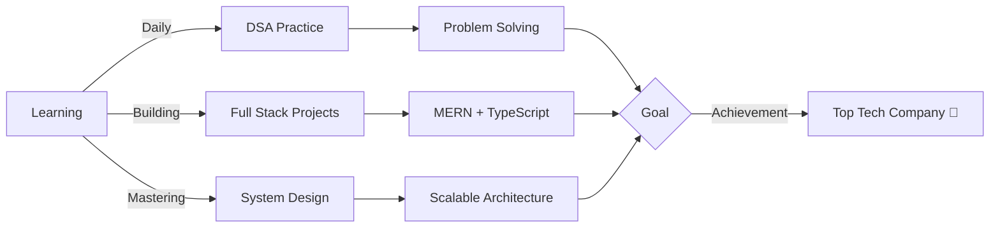

<!-- Animated Wave Header -->
<div align="center">
  
</div>

<!-- Typing Animation -->
<p align="center">
  
</p>

<!-- Animated Divider -->


## 🎯 About Me

```typescript
const krishna = {
    role: "Full Stack Developer",
    education: "B.Tech CSE @ GLA University",
    year: "Pre-Final Year",
    passion: ["Competitive Programming", "Web Development", "Problem Solving"],
    achievement: "1100+ DSA Problems Solved 🔥",
    currentFocus: ["System Design", "Backend Architecture", "TypeScript"],
    lifeGoal: "Build impactful software that changes lives 🚀"
};
```

<div align="center">
  
### 🏆 **Quick Highlights**
  


</div>


## 🛠️ Tech Arsenal

<div align="center">

### 💻 **Programming Languages**
<p>
  
</p>

### 🎨 **Frontend Development**
<p>
  
</p>

### ⚙️ **Backend & Databases**
<p>
  
</p>

### 🧰 **Tools & Platforms**
<p>
  
</p>

</div>


## 📊 GitHub Analytics

<div align="center">
  
  
</div>

<div align="center">
  
  
</div>

<div align="center">
  
</div>


## 🏅 Coding Profiles

<div align="center">

### 💡 **LeetCode Journey**


<br/>

### 🌟 **Competitive Programming**

[](https://leetcode.com/u/krishna_singh24/)
[](https://codeforces.com/profile/krishna_Singh25)
[](https://www.codechef.com/users/krishna2027)

</div>


## 🎯 Current Mission

<div align="center">



</div>

<table align="center">
  <tr>
    <td align="center">🚀 Building scalable applications</td>
    <td align="center">🧠 Mastering advanced DSA</td>
  </tr>
  <tr>
    <td align="center">⚡ TypeScript + Node.js projects</td>
    <td align="center">💼 Preparing for FAANG interviews</td>
  </tr>
</table>


## 📬 Let's Connect!

<div align="center">
  
[](mailto:krishnasinghks1225@gmail.com)
[](https://www.linkedin.com/in/krishna-singh-994336294/)
[](https://github.com/krishnasingh20)

<p>
  
</p>

</div>


## 💝 Show Some Love

<div align="center">

### If you like what I do, consider:

⭐ **Starring my repositories** — It motivates me to create more!  
🔔 **Following me** — Stay updated with my latest projects  
💬 **Connecting with me** — Let's build something amazing together!


</div>

<!-- Animated Footer -->
<div align="center">
  
</div>

---

<div align="center">
  
</div>
